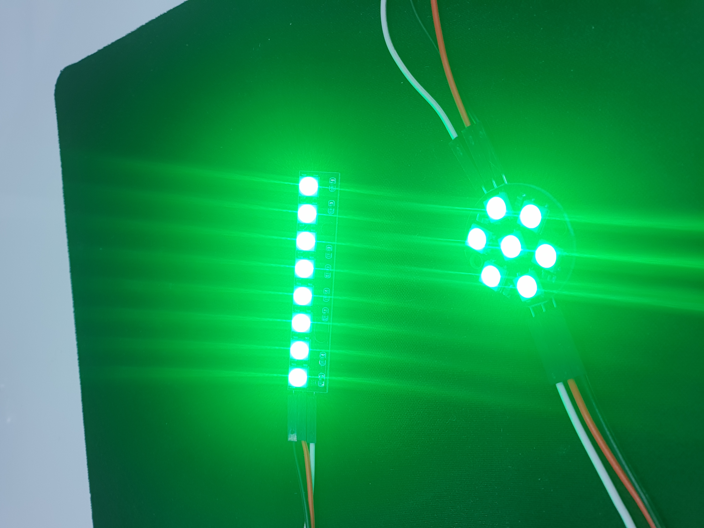

# NeoPixel(WS2812)	
	- 하나의 led로 RGB값을 조절하여 여러 색을 표현할 수 있는 LED입니다.
	- 또한 컨트롤러로 각 led를 개별적으로 제어 가능합니다.

	- 본문에서 리뷰한 모델은 납땜을 하여 사용하였습니다.
	- 단자는 총 6개 혹은 8개이며 6개의 경우 (IN, VCC 두개, GND 두개, OUT)이며 8개는 6개에 GND두개가 추가된 형태입니다.	
	- Neopixel은 보드에 연결된 neopixel의 out단자에 두번째 neopixel의 in단자를 연결시키면 보드에 하나의 핀만 연결하여 사용할 수 있습니다.

## 제품 사진

## 사양
	- 작동 전압 : 5V
	- 각 led당 20mA ~ 80mA

## 필요 하드웨어
	- NeoPixel
	- Arduino UNO
	- UNO cable
	- M-M cable(6ea)
	- F-M cable(3ea)

## 연결
	- neopixel, arduino 간 연결

|neopixel|arduino|
|--|--|
|IN|D7|
|VCC|5V|
|GND|GND|

	- 1^st^ neopixel, 2^nd^ neopixel 간 연결(3^rd^, 4^th^도 동일하게 연결)

|1^st^ neopixel|2^nd^ neopixel|
|--|--|
|OUT|IN|
|VCC|VCC|
|GND|GND|

## 라이브러리
	- Adafruit_NeoPixel

## example_code1.cpp 참고
	- 실행 결과

## example_code2.cpp
	- led가 순차적으로 흰색 -> 적색 -> 녹색 -> 청색으로 점등하는 코드